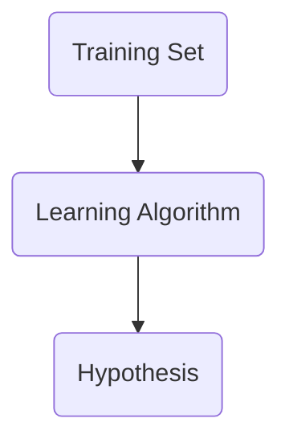

# What is Machine Learning?
1959 - Being able to learn without being explicitly programmed
1998 - Learn from experience (**E**) with respect to a task (**T**) and some performance measure (**P**).  It's learning if **P** on **T** improves with **E**.

Supervised Learning | Unsupervised Learning
------------ | ------------ 
Right answers are given | Discovery & Clustering

Regression | Classification
------------ | ------------ 
Predicts continous valued output | Predicts discrete valued output

#### Notation
*This is the notation for this classes notes*
**m** = # of Training Examples
**x** = "input" variables/features
**y** = "output" variables
(**x**,**y**) = Training Example
$(x^{(i)},y^{(i)})$ = -ith training example

#### Supervised Learning Algorithm

Basic Univariate Linear Regression Hypothesis
$h_{\theta}(x) = \theta_{0} + \theta_{1}x$

